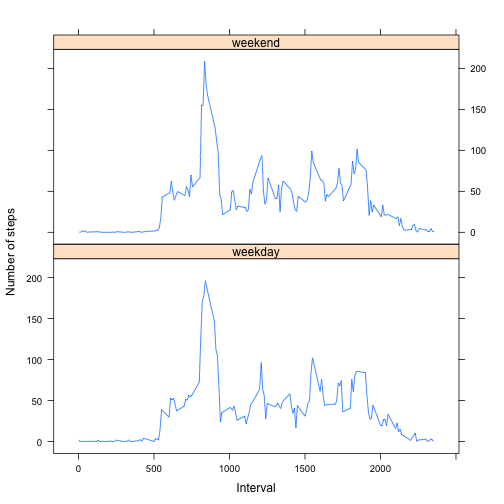

# Reproducible Research: Peer Assessment 1

## Loading and preprocessing the data

First lets load the data and massage it, the steps are:

* Load *plyr* since we will use it for massaging the dataset;
* Load the actual file;
* Remove the rows with *NAs* since we can't do anything with them;
* Generate a separate data frame with the sum of steps per day;
* Generate another dataset with the mean of steps across all days for every interval;

```r
library(plyr)
activities <- read.csv("activity.csv", colClasses=c("integer", "Date", "integer"))
activities$weekday <- weekdays(activities$date)
completes <- complete.cases(activities)
cleanActivities <- activities[completes,]
activitiesPerDay <- ddply(
    cleanActivities,
    .(date),
    summarise,
    steps=sum(steps))
averagePerInterval <- ddply(
    cleanActivities,
    .(interval),
    summarise,
    steps=mean(steps))
```

## What is mean total number of steps taken per day?

Now let's look at a histogram of the total number of steps taken each day:


```r
meanSteps <- mean(activitiesPerDay$steps)
medianSteps <- median(activitiesPerDay$steps)
hist(activitiesPerDay$steps, main="Histogram of steps per day", xlab="Steps per day", breaks=10)
```


The mean of steps taken per day is *1.0766 &times; 10<sup>4</sup>* and the median is *10765*.

## What is the average daily activity pattern?

Now we go for the average of steps taken across all days for every 5 minutes interval:


```r
maxIntervalPos = which.max( averagePerInterval$steps )
maxInterval <- averagePerInterval[maxIntervalPos,]$interval
maxIntervalSteps <- averagePerInterval[maxIntervalPos,]$steps
plot(averagePerInterval$interval,  averagePerInterval$steps, type="l", main="Average of steps across all days for every interval", xlab="5 minutes intervals", ylab="Average steps taken")
```


And from here we can see that the interval with more steps in average was *835* that had *206.1698* steps on average.

## Imputing missing values


```r
missingRows <- sum(!completes)
```

The dataset contains *2304* rows with **NA** values.

To include values for the missing rows, we can use the means calculated for every interval, but just that could lead us to using an all days average when we can also use the weekday value and include the means for that specific weekday that is missing.


```r
averagePerIntervalAndWeekday <- ddply(
    cleanActivities,
    .(interval, weekday),
    summarise,
    steps=mean(steps))
incompletes <- activities[!completes,]
stepsFor <- function( interval, weekday ) {
  averagePerIntervalAndWeekday[averagePerIntervalAndWeekday$interval == interval &
                                 averagePerIntervalAndWeekday$weekday == weekday,]$steps
}
incompletes$steps <- mapply(stepsFor, incompletes$interval, incompletes$weekday)
filledActivities <- rbind(cleanActivities, incompletes)
```

We have now filled in the missing steps values with means from intervals for the same weekdays that were missing. Let's look at the histogram:


```r
filledActivitiesPerDay <- ddply(
    filledActivities,
    .(date),
    summarise,
    steps=sum(steps))
filledMeanSteps <- mean(filledActivitiesPerDay$steps)
filledMedianSteps <- median(filledActivitiesPerDay$steps)
hist(filledActivitiesPerDay$steps, main="Histogram of steps per day (with filled data)", xlab="Steps per day", breaks=10)
```


And now the mean of steps taken per day is *1.0821 &times; 10<sup>4</sup>* (difference from clean dataset is 55.0209) and the median is *1.1015 &times; 10<sup>4</sup>* (difference from clean dataset is 250).

Given these numbers, the actual difference between the original cleaned up dataset and this new dataset with data pulled out of means of intervals on weekdays is very small.

## Are there differences in activity patterns between weekdays and weekends?

Can we spot differences between weekdays and weekends? Let's first mark every row as weekday or weekend on our dataset:


```r
dayType <- factor(c("weekday", "weekend"))
isWeekend <- function( weekday ) {
  if (weekday %in% c("Saturday", "Sunday")) {
    dayType[2]
  } else {
    dayType[1]
  }
}
filledActivities$dayType <- mapply(isWeekend, filledActivities$weekday)
filledAveragePerInterval <- ddply(
    filledActivities,
    .(interval),
    summarise,
    steps=mean(steps))
```

Now that we have the data correctly marked, let's plot both cases and see how the data looks like:


```r
library(lattice)
xyplot(steps ~ interval | dayType, filledAveragePerInterval, layout = c(1, 2), xlab="Interval", ylab="Number of steps", type="l")
```



And while there are small differences, doesn't look like there's a lot of differences in the general patterns of steps between weekdays and weekends.
